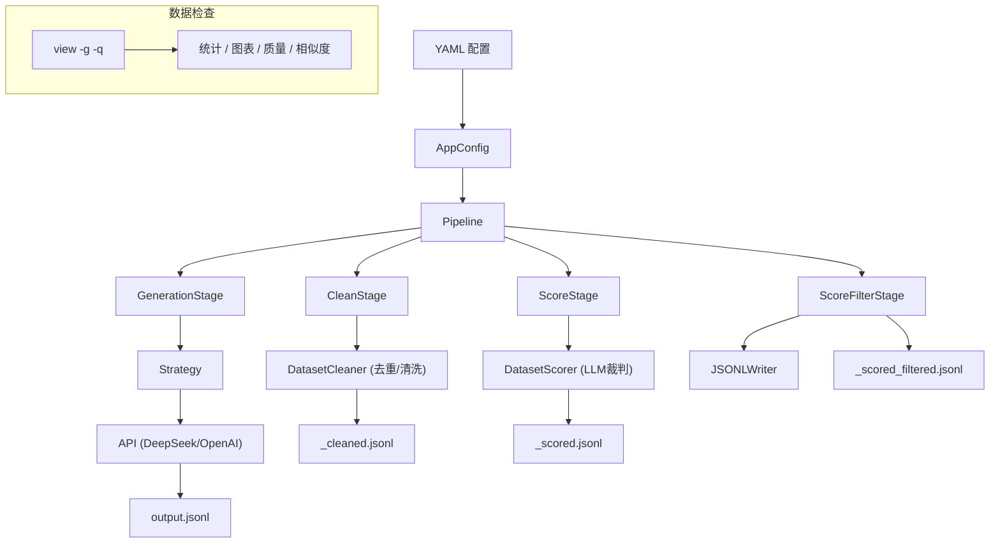
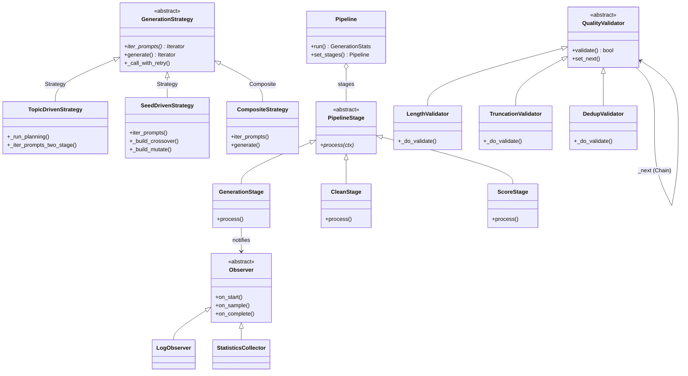
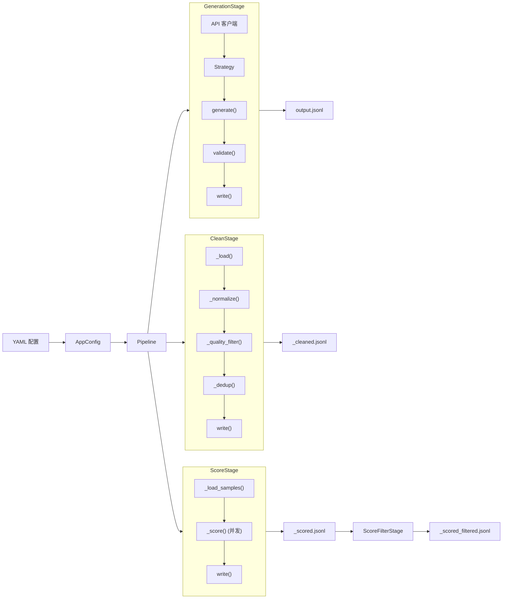

# Alembic — 项目设计与架构

Alembic 将原始主题蒸馏为 SFT（监督微调）训练数据,通过可插拔管线完成生成、清洗、评分与检查。

## 快速开始

```powershell
# 生成
python -m alembic.cli generate --config sft_gen_config.yaml --count 1000

# 检查
python -m alembic.cli view output.jsonl -g -q

# 清洗
python -m alembic.cli clean input.jsonl -o output.jsonl --config sft_gen_config.yaml
```

## 架构总览



## 目录结构

```
alembic/
├── cli.py              # 5 个命令：generate / clean / score / view / list-templates
├── config.py           # 6 个 dataclass：AppConfig → API / Strategy / Quality / Output / Cleaner / Scoring
├── registry.py         # 3 个可插拔注册表 + 工厂函数
│
├── api/                # LLM API 客户端
│   ├── base.py         # BaseAPIClient 抽象类、RetryConfig、retry_with_backoff、RetryDecorator
│   ├── providers.py    # OpenAICompatibleClient
│   └── embedding.py    # 独立 Embedding API（语义去重用）
│
├── core/               # 管线编排与数据检查
│   ├── pipeline.py     # Pipeline 外观类 — 通过 StageRegistry 装配阶段
│   ├── stages.py       # 4 个 PipelineStage 子类 + StageRegistry + PipelineContext
│   ├── inspector.py    # DatasetInspector — 统计、分布、图表、相似度、质量
│   ├── observer.py     # Observer 抽象类 + LogObserver + CompositeObserver
│   ├── stats.py        # StatisticsCollector（实现 Observer）、报告生成
│   └── types.py        # 领域类型：GenerationSample、GenerationStats、SeedSample
│
├── strategies/         # 生成策略（策略模式）
│   ├── base.py         # GenerationStrategy 抽象类 + 重试、并发分发
│   ├── topic_driven.py # 两阶段：规划 → 执行，子主题分支
│   ├── seed_driven.py  # 基于种子示例的生成（few-shot）+ 进化算子（交叉/变异）
│   └── composite.py    # CompositeStrategy + merge_generators
│
├── cleaner/            # 生成后清洗
│   ├── cleaner.py      # DatasetCleaner：规范化 → 过滤 → 去重 → 写出
│   ├── dedup.py        # DedupStrategy 抽象类 → MinHashDedup / SemanticDedup / NoDedup
│   └── ops.py          # 文本操作：URL/HTML 移除、重复率、MinHash 分词
│
├── quality/            # 质量验证（责任链模式）
│   ├── validators.py   # QualityValidator 链：长度 → 截断 → 去重
│   └── rules.py        # QualityRule 抽象类、LengthRule、RatioRule、QualityRuleSet
│
├── scoring/            # LLM 裁判评分
│   └── scorer.py       # DatasetScorer：按维度评分
│
├── prompts/            # Jinja2 提示词模板
│   ├── builder.py      # PromptBuilder — 流式模板引擎，自动语言切换（_zh）
│   └── templates/      # 28 个 .j2 文件：planner / topic_driven / seed / seed_crossover / seed_mutate / scorer
│                        #   均有 _zh（中文）和 _mt（多轮对话）变体
│
└── writers/            # 输出写出器
    └── jsonl_writer.py # JSONLWriter（alpaca / chatml / sharegpt 格式）
```

## 设计模式



## 管线流程




## 生成策略

### TopicDrivenStrategy（两阶段）
1. **规划**：LLM 生成计划 — 每个主题下 `{sub_topic, angle, difficulty, question_type}` 列表
2. **执行**：计划项分组为批次，每批次将 plan_header 追加到用户提示词，交由 LLM 生成 JSON 数组

```yaml
strategies:
  - type: topic_driven
    topics:
      - topic: "Python 编程基础"
        knowledge: "语法、数据类型、控制流..."
    total_count: 100
    max_samples_per_request: 5      # 每次 API 调用最多生成条数
    execution_max_per_request: 10   # 每批次最多合并计划项数
```

### SeedDrivenStrategy
基于种子示例（few-shot）模仿其风格与深度生成样本。支持进化算子（`evolution` 配置）：

- **交叉（crossover）**：随机抽取两个种子 A/B，按 `crossover_mode` 生成新样本
  - `instruction_output`：A 出指令 + B 出输出风格
  - `compose`：合并 A、B 主题为复合任务
- **变异（mutate）**：随机选一个种子，施加用户自定义的变异类型（改难度、换语气、加约束等）
  - `mutation_types` 必须显式配置，每项定义 `name`/`prompt`/`values`（可选 `override_field`）

每次生成按 `crossover_rate` / `mutate_rate` 轮盘赌选择模式，剩余概率走默认 few-shot。详见 [config.md](config.md#evolution--交叉与变异)。

```yaml
strategies:
  - type: seed_driven
    seed_file: ./seeds.jsonl
    target_count: 100
    evolution:
      crossover_rate: 0.3
      mutate_rate: 0.3
      mutation_types:
        - name: difficulty
          values: [beginner, advanced]
          prompt: "Change the difficulty to '{value}'"
        - name: tone
          values: [formal, casual]
          prompt: "Rewrite in a {value} tone"
```

### CompositeStrategy
加权合并多个策略，通过 `merge_generators` 交错输出。

## 注册表（插件系统）

所有注册表继承 `Registry[T]`（`alembic/registry.py`）：

```python
from alembic.registry import provider_registry, strategy_registry, stage_registry

# 添加自定义 Provider
provider_registry.register("anthropic", AnthropicClient)

# 添加自定义策略
strategy_registry.register("my_strategy", MyStrategy)

# 添加自定义阶段
stage_registry.register("translate", TranslateStage)
Pipeline(config).set_stages("generate", "clean", "translate").run()
```

## 配置结构

```yaml
api:
  model: deepseek-v4-flash
  api_key: "sk-..."
  base_url: "https://api.deepseek.com"
  lang: zh                    # 自动选择 _zh.j2 中文模板
  concurrency: 8              # 并发数

strategies:
  - type: topic_driven
    topics: [...]
    total_count: 100

cleaner:
  dedup_strategy: minhash     # minhash | semantic | none
  dedup_threshold: 0.88

scoring:
  enabled: true
  dimensions:
    - name: accuracy
      max_score: 10

output:
  path: ./output.jsonl
  format: alpaca              # alpaca | chatml | sharegpt
```

## 数据检查（view 命令）

```powershell
python -m alembic.cli view data.jsonl          # 文本统计
python -m alembic.cli view data.jsonl -g       # 柱状图（长度、话题、策略）
python -m alembic.cli view data.jsonl -q       # 质量 + 相似度（MinHash）
python -m alembic.cli view data.jsonl -g -q    # 完整仪表盘
python -m alembic.cli view data.jsonl -n 3     # 显示 3 条样本
python -m alembic.cli view data.jsonl --json   # JSON 格式输出
```

仪表盘分区（平凡分区自动隐藏）：

| 分区 | 内容 |
|------|------|
| DATA PROFILE | 总数、格式分布 |
| TOPICS | 柱状图（>1 个话题时展示） |
| LENGTH | 指令/输出长度直方图 + min/max/mean/p50 |
| QUALITY `-q` | 词/字重复率、空字段检测 |
| SIMILARITY `-q` | 最大成对 MinHash 相似度直方图、Top 相似样本对 |
| SAMPLES `-n N` | 内联样本预览 |

## 并发与重试

- **并发**：`ThreadPoolExecutor`，并发数由 `api.concurrency` 配置。适用于 topic_driven、seed_driven。
- **重试**：统一使用 `retry_with_backoff(fn, RetryConfig)`，指数退避。应用于：
  - API 层：`RetryDecorator` 包装 `BaseAPIClient`
  - 策略层：`GenerationStrategy._call_with_retry`
  - 规划层：`_plan_topic_with_retry`
  - 评分层：`_score_one_safe`

## 质量检查

### 生成时（内联）
- **长度**：`instruction_min/max_len`、`output_min/max_len`
- **截断**：检测输出是否被截断
- **去重**：批次内精确指纹去重

### 生成后（cleaner）
- **文本清洗**：移除 URL、HTML、邮件、Markdown 链接
- **去重**：MinHash（128 排列，快速）或 Semantic（Embedding 余弦相似度）
- **格式**：通过 `field_map` 重映射字段键

### 数据检查（view）
- **相似度**：成对 MinHash — 近重复数、分布、Top 相似对
- **重复率**：词/字重复率直方图
- **解析错误**：JSON 解码失败计数
- **空字段**：缺失 instruction/output 检测
