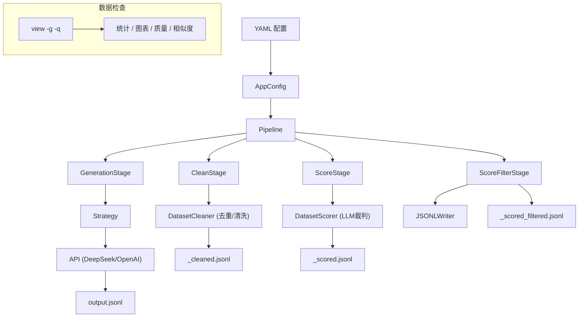
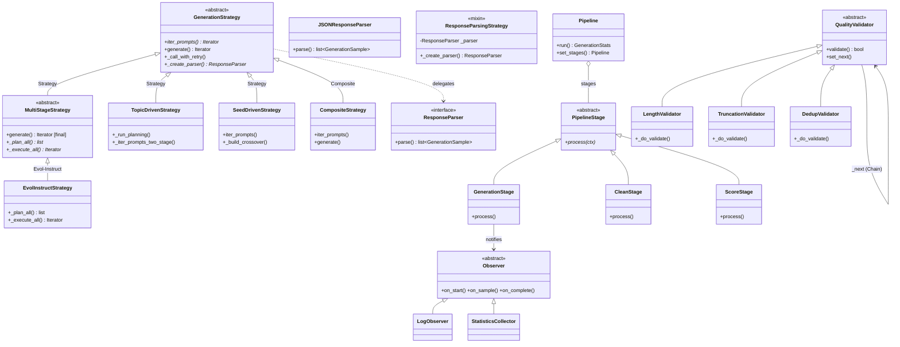
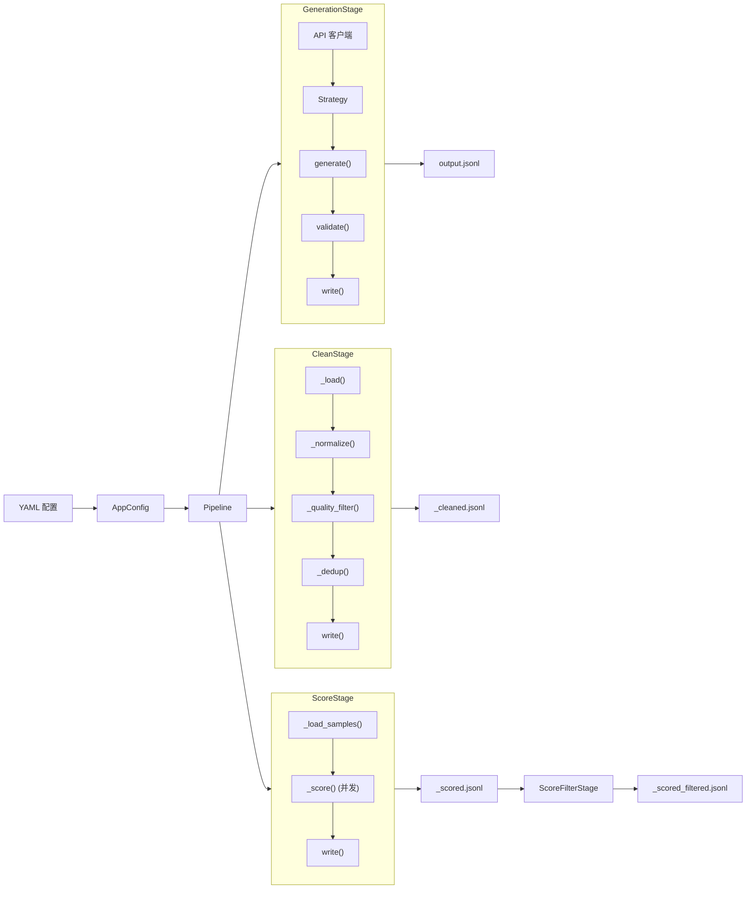

# Alembic — 项目设计与架构

Alembic 将原始主题蒸馏为 SFT（监督微调）训练数据,通过可插拔管线完成生成、清洗、评分与检查。

## 快速开始

```powershell
# 生成
python -m alembic.cli generate --config sft_gen_config.yaml --count 1000

# 检查
python -m alembic.cli view output.jsonl -g -q

# 清洗
python -m alembic.cli clean input.jsonl -o output.jsonl --config sft_gen_config.yaml
```

## 架构总览



## 目录结构

```
alembic/
├── cli.py              # 5 个命令：generate / clean / score / view / list-templates
├── config.py           # 6 个 dataclass：AppConfig → API / Strategy / Quality / Output / Cleaner / Scoring
├── registry.py         # 3 个可插拔注册表 + 工厂函数
│
├── api/                # LLM API 客户端
│   ├── base.py         # BaseAPIClient + RetryConfig + retry_with_backoff + RetryDecorator
│   ├── providers.py    # OpenAICompatibleClient
│   └── embedding.py    # 独立 Embedding API（语义去重用）
│
├── core/               # 管线编排、数据检查、响应解析
│   ├── pipeline.py     # Pipeline 外观类 — 通过 StageRegistry 装配阶段
│   ├── stages.py       # 4 个 PipelineStage 子类 + StageRegistry + PipelineContext
│   ├── parser.py       # ResponseParser 类层次 — JSON 响应解析，替代 God Method _parse()
│   ├── inspector.py    # DatasetInspector — 统计、分布、图表、相似度、质量
│   ├── observer.py     # Observer + LogObserver + CompositeObserver
│   ├── stats.py        # StatisticsCollector（实现 Observer）、报告生成
│   └── types.py        # 领域类型：GenerationSample / SeedSample / GenerationStats
│
├── strategies/         # 生成策略（策略模式）
│   ├── base.py         # GenerationStrategy ABC + MultiStageStrategy ABC + 重试 / 并发分发
│   ├── topic_driven.py # 两阶段：规划 → 执行，子主题分支
│   ├── seed_driven.py  # 基于种子示例的生成（few-shot）+ 进化算子（交叉/变异）
│   ├── evol_instruct.py# 迭代指令进化（Evol-Instruct）：多轮深度/广度变异
│   └── composite.py    # CompositeStrategy + merge_generators
│
├── cleaner/            # 生成后清洗
│   ├── cleaner.py      # DatasetCleaner：规范化 → 过滤 → 去重 → 写出
│   ├── dedup.py        # DedupStrategy → MinHashDedup / SemanticDedup / NoDedup
│   └── ops.py          # 文本操作：URL/HTML 移除、重复率、MinHash 分词
│
├── quality/            # 质量验证（责任链模式）
│   ├── validators.py   # QualityValidator 链：长度 → 截断 → 去重
│   └── rules.py        # QualityRule + LengthRule + RatioRule + QualityRuleSet
│
├── scoring/            # LLM 裁判评分
│   └── scorer.py       # DatasetScorer：按维度评分
│
├── prompts/            # Jinja2 提示词模板
│   ├── builder.py      # PromptBuilder — 流式模板引擎，自动语言切换（_zh）
│   └── templates/      # 38+ 个 .j2 文件：planner / topic_driven / seed / seed_crossover /
│                        #   seed_mutate / scorer / evol_system / evol_depth_user /
│                        #   evol_breadth_user / evol_answer_system / evol_answer_user /
│                        #   均有 _zh（中文）和 _mt（多轮对话）变体
│
└── writers/            # 输出写出器
    └── jsonl_writer.py # JSONLWriter（alpaca / chatml / sharegpt 格式）
```

## 设计模式



### 核心模式说明

| 模式 | 位置 | 说明 |
|------|------|------|
| **策略** | `GenerationStrategy` + 4 个子类 | 可替换的生成算法 |
| **模板方法** | `GenerationStrategy.generate()` / `MultiStageStrategy.generate()` | 骨架固定，子类仅实现 hook |
| **复合** | `CompositeStrategy` | 多策略加权组合 |
| **责任链** | `QualityValidator` 链 | 长度 → 截断 → 去重 |
| **观察者** | `Observer` → `StatisticsCollector` | 生成事件跟踪 |
| **工厂** | `Registry` + `create_strategy()` | 按名称创建策略 |
| **装饰器** | `RetryDecorator` | API 层透明重试 |
| **解析器分离** | `ResponseParser` 类层次 | 响应解析从策略中解耦 |

## 管线流程



## 生成策略

### TopicDrivenStrategy（两阶段）
1. **规划**：LLM 生成计划 — 每个主题下 `{sub_topic, angle, difficulty, question_type}` 列表
2. **执行**：计划项分组为批次，每批次将 plan_header 追加到用户提示词，交由 LLM 生成 JSON 数组

```yaml
strategies:
  - type: topic_driven
    topics:
      - topic: "Python 编程基础"
        knowledge: "语法、数据类型、控制流..."
    total_count: 100
    max_samples_per_request: 5
    execution_max_per_request: 10
```

### SeedDrivenStrategy
基于种子示例（few-shot）模仿其风格与深度生成样本。支持进化算子（`evolution` 配置）：

- **交叉（crossover）**：随机抽取两个种子 A/B，按 `crossover_mode` 生成新样本
- **变异（mutate）**：随机选一个种子，施加用户自定义的变异类型

详见 [config.md](config.md#seed_driven)。

```yaml
strategies:
  - type: seed_driven
    seed_file: ./seeds.jsonl
    target_count: 100
    evolution:
      crossover_rate: 0.3
      mutate_rate: 0.3
      mutation_types:
        - name: difficulty
          values: [beginner, advanced]
          prompt: "Change the difficulty to '{value}'"
```

### EvolInstructStrategy（进化指令）
迭代式指令进化（基于 WizardLM Evol-Instruct 论文），两阶段：

```
Phase 1 — 进化: seed ──round_1──→ v1 ──round_2──→ v2 ──round_N──→ vN
Phase 2 — 回答: vN ──LLM──→ (vN, output)
```

每轮每个指令以 `depth_rate` 概率走**深度进化**（4 类算子：加约束、加深、具体化、推理链），另有 `branch_factor` 条**广度进化**（同域新指令）。进化结果经过长度/拒绝短语/重复性验证后才进入下一轮池。

```yaml
strategies:
  - type: evol_instruct
    seed_file: ./seeds.jsonl
    max_rounds: 3
    depth_rate: 0.7
    branch_factor: 1
    depth_mutations:
      - name: add_constraint
        prompt: "Add one or more specific constraints or requirements"
      - name: deepen
        prompt: "Increase the depth and breadth of the inquiry"
      - name: concretize
        prompt: "Replace general concepts with more specific concepts"
      - name: increase_reasoning
        prompt: "Request explicit multiple-step reasoning"
```

每条样本元数据携带完整进化链，详见 [config.md](config.md#evol_instruct)。

### CompositeStrategy
加权合并多个策略，通过 `merge_generators` 交错输出。

## 注册表（插件系统）

所有注册表继承 `Registry[T]`（`alembic/registry.py`）：

```python
from alembic.registry import provider_registry, strategy_registry, stage_registry

# 添加自定义 Provider
provider_registry.register("anthropic", AnthropicClient)

# 添加自定义策略
strategy_registry.register("my_strategy", MyStrategy)

# 添加自定义阶段
stage_registry.register("translate", TranslateStage)
Pipeline(config).set_stages("generate", "clean", "translate").run()
```

## 并发与重试

- **并发**：`ThreadPoolExecutor`，并发数由 `api.concurrency` 配置。evol_instruct 另有独立 `evol_concurrency` 参数控制进化阶段的并发。
- **重试**：统一使用 `retry_with_backoff(fn, RetryConfig)`，指数退避。应用于：
  - API 层：`RetryDecorator` 包装 `BaseAPIClient`（3 次）
  - 策略层：`GenerationStrategy._call_with_retry`（3 次）
  - 进化层：EvolInstruct 回答生成（3 次）
  - 规划层：`TopicDriven._plan_slots_with_retry`（3 次）
  - 评分层：`DatasetScorer._score`（3 次）

## 质量检查

### 生成时（内联）
- **长度**：`instruction_min/max_len`、`output_min/max_len`
- **截断**：检测输出是否被截断
- **去重**：批次内精确指纹去重

### 生成后（cleaner）
- **文本清洗**：移除 URL、HTML、邮件、Markdown 链接
- **去重**：MinHash（128 排列，快速）或 Semantic（Embedding 余弦相似度）
- **格式**：通过 `field_map` 重映射字段键

### 数据检查（view）
- **相似度**：成对 MinHash — 近重复数、分布、Top 相似对
- **重复率**：词/字重复率直方图
- **解析错误**：JSON 解码失败计数
- **空字段**：缺失 instruction/output 检测
